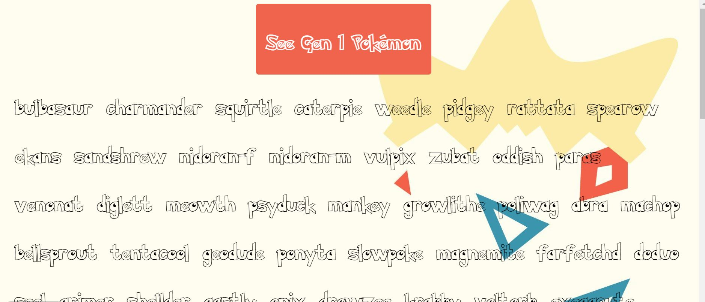

# Pokémon Generation One Name API
Click a button and you'll recieve a full list of all 151 Generation one Pokémon.

Link to project: https://menahassan-pokemon-api.netlify.app/

# How It's Made
Tech used: HTML, CSS, JavaScript

# Lessons Learned:
Working on this project allowed me to practice using the fetch method to grab data from an API. The most painful part of this experience was finding APIs that were free and functional. Fortunately, there are some great ones out there if you do a bit of digging. I'm a Pokémon lover so this was a fun project.

Once you find a functional API, the rest of the work is fairly straightforward. You just need to map out the path to each data point you're looking to grab. This process looks slightly different for each API you're using since not all data is organized the same way but there's enough of an overlap so that you can generally get a sense of the pattern you need to follow.

This project exposed me to some new things -- I learned that you can create an unordered list within JavaScript. I had only created individual list items before. The more I learn the more I realize that if you have the question "can I do this?", the answer is probably "yes".

